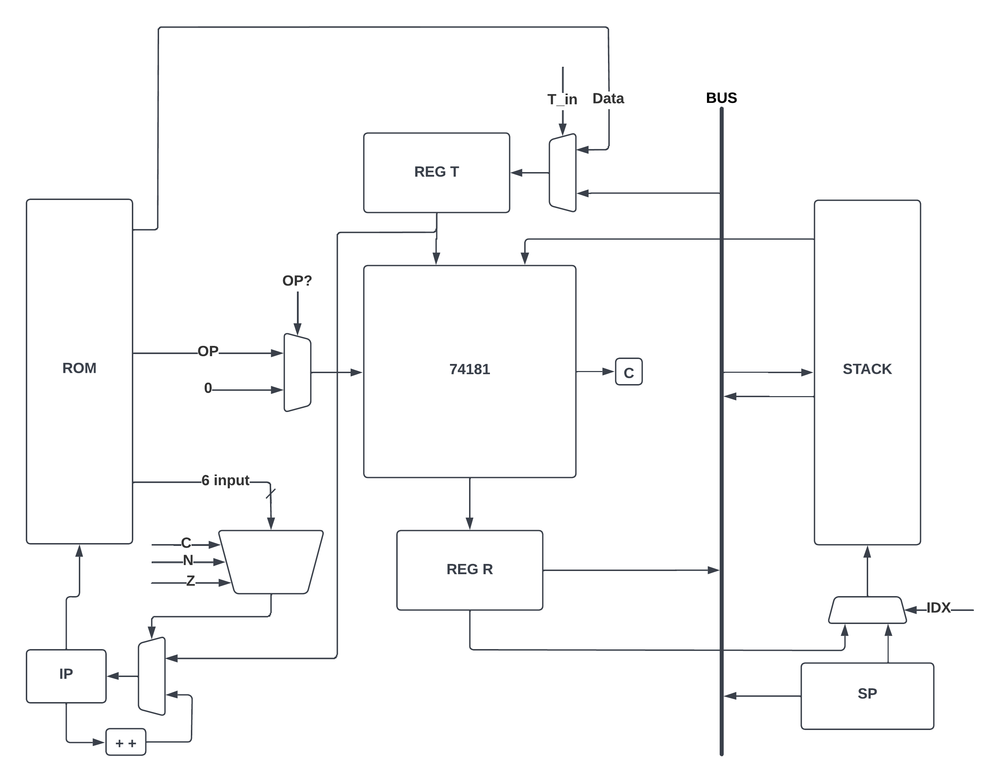

# Simple 16-Bit CPU
Sai Sudhir Sunku -- PES2UG21CS460 \\ Samarth Ramesh -- PES2UG21CS465 \\ Sanket Padhi -- PES2UG21CS477

## Abstract
Our project proposes and implements a 16-bit CPU, using a Harvard Architecture.
It has 16 bits of address-space, 16-bit words, and 18-bit wide instructions.

The CPU has been designed to be Stack based, as a result of which most of the memory operations are performed at the top.
However, random access is also possible.

Two general purpose registers `T` and `R` have been provided for.
The `T` register is used as the first input for the ALU, the top of the stack being the second,  while the `R` is the output of the ALU.

The Stack Pointer (`SP`) is stored in the eponymous register.
The address of the instruction being executed is stored in the IP register.

The ALU itself is a COTS component, the venerable 74181 ALU, which supports 32 different operations.

The Instruction set supports 3 primary classes of instruction, data (`DT`), move (`MV`) and operate (`OP`).

## Schematic Diagram

